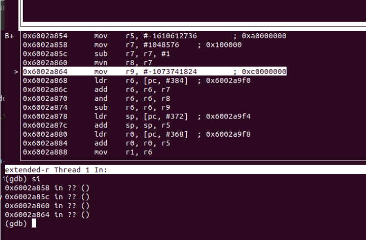

# GDB 代码调试方法记录

在开发的过程中，有时没有现成的图形化开发环境，想要进行调试时，需要使用 GDB 直接进行代码调试。本文档记录了以 RT-Thread   `qemu-vexpress-a9` BSP 为例，使用 GDB 对 RT-Smart 进行代码调试的方法。

## 准备

### 开发配置

1. 在 `~/.bachrc` 配置好工具链地址，避免重复配置。
```
export RTT_CC=gcc
export RTT_EXEC_PATH=your_musleabi_toolchain_path/bin
export RTT_CC_PREFIX=arm-linux-musleabi-
export PATH=$PATH:$RTT_EXEC_PATH:$RTT_EXEC_PATH/../arm-linux-musleabi/bin
```

2. 编译项目，生成 elf 格式的可执行文件。 

- scons 编译工程
- 运行 `qemu-dbg.bat` 以调试模式启动 QEMU 模拟

### 使用调试器

可以选择 arm-none-eabi-gdb 或者 gdb-multiarch 作为 gdb 服务端进行调试。

#### 使用 `gdb-multiarch` 

- 安装 `gdb-multiarch` 作为 gdb 服务端 
- `gdb-multiarch rtthread.elf -ex "tar ext localhost:1234"` 连接到 QEMU 进行代码调试

#### 使用 `arm-none-eabi-gdb`

- `arm-none-eabi-gdb rtthread.elf -ex "tar ext localhost:1234"` 连接到 QEMU 进行代码调试

#### 图形化界面

如果想要以 GUI 模式启动 gdb，可以在命令行中添加参数 `-tui`，如下面的命令：

- `gdb-multiarch rtthread.elf -ex "tar ext localhost:1234" -tui`

## GDB 调试操作

### 打开和关闭

| 命令                     | 说明           |
| ------------------------ | -------------- |
| ctrl + d                 | 退出 GDB       |
| ctrl + a，松开后再按下 x | 退出 QEMU 调试 |

### 常用调试命令

| 命令    | 说明                                                       |
| ------- | ---------------------------------------------------------- |
| r       | Start debugged program                                     |
| c       | Continue program being debugged                            |
| n       | Step program                                               |
| ni      | 运行到下一条汇编指令，但是不进行 bl 跳转                   |
| s       | Step program until it reaches a different source line      |
| si      | 运行到下一条汇编指令，会跳转到下一条汇编执行，跟进 bl 命令 |
| b       | Set breakpoint at specified line or function               |
| display | Print value of expression EXP each time the program stops  |
| p       | Print value of expression EXP                              |
| q       | 退出 gdb                                                   |

如果打 s、n 指令的话，必须要有源代码支持，如果没有源代码支持，只能打出 si、ni，这里  si ni 是针对反汇编指令来说的，如果有源代码的话就可以使用 s、n 指令。

### 断点操作命令

| 命令           | 说明                                 |
| -------------- | ------------------------------------ |
| info b         | 查询当前系统中断点命令，简写为 `i b` |
| dis + 断点编号 | 使指定编号的断点 disable             |
| ena + 断点编号 | 使指定编号的断点 enable              |
| del + 断点编号 | 删除指定编号的断点                   |

### 查看反汇编

1. 按下 ctrl + x 然后再按下 2 将会切换视图，例如汇编视图和寄存器视图
2. 按下 ctrl + x 然后再按下 1 将会聚焦选择其中一个视图

### 调试示例

因为 RT-Smart 内核的加载地址与链接地址不一致，所以开始调试时，只能将调试断点打在 MMU 使能之后。


打开图形化界面后，使用 si 指令进行单步调试：


如果想观察寄存器中数值的变化，可以切换到通用寄存器视角：


## 常见问题

### 加载地址与链接地址不一致问题

在 RT-Smart 调试的过程中，发现如果把断点打在 `_reset` 符号时，执行调试时无法停在指定的断点，这个问题的原因是程序的链接地址与加载地址不一致导致的。

RT-Smart 系统被链接在 `0xC0000000` 起始的地址上，但是加载地址为 `0x60000000`，这就导致了在 MMU 没有开启之前，GDB 尝试到 `0xC0000000` 的地址去找符号相应的代码，但是却无法找到。

解决的办法是在指定符号的链接地址上减去 PV_OFFSET，打断点的时候可以使用如下指令：

```shell
b *((char *)_reset + 0xa0000000) 
```

以上命令即可将断点打在相应的物理地址上，此时打开 GDB 的代码调试窗口，还不能看到对应汇编源码，但是在浏览窗口可以看到反汇编代码，使用 si ni 指令查看汇编代码调试。



这里 `0xa0000000` 就是 PV_OFFSET。如果是想从物理地址获得虚拟地址，需要 P - (P-V) = V，如果是先要从虚拟地址获得物理地址，则需要 V + (P - V) = P。

这里的 PV_OFFSET 是 0xa0000000 而不是 0x60000000，是因为要用物理地址减去虚拟地址，而不是用虚拟地址减去物理地址.

### 栈溢出问题

栈内存被写穿的情况，由于线程栈太小，导致在函数较深调用时，导致栈溢出，破坏了系统中其他的数据结构。如果在调试的时候发现，某个变量在没有主动修改的时候突然发生改变，可以怀疑是否出现了栈溢出。