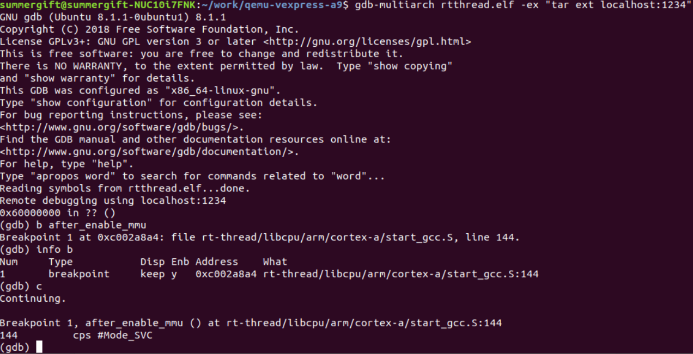
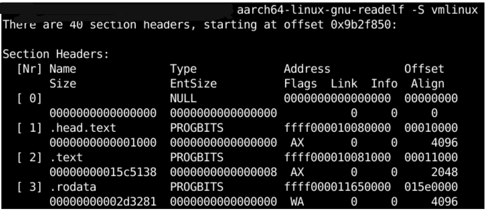

# RTOS 内核调试技巧

记录在嵌入式开发的过程中的调试技巧。

## 基础技巧

### 反汇编

在代码调试以及查找错误时，有时会需要对 elf 进行反汇编做代码查看和对比的情况，此时需要使用工具链进行反汇编，命令如下：

```shell
arm-linux-musleabi-objdump -S rtthread.elf > rtthread.S
```

### 预处理

GCC 的“-E”选项可以让编译器在预处理阶段就结束，选项“-o”可以指定输出的文件格式。通过编译器的预处理，可以查看真实参与编译代码的实际情况，便于理解代码。另外在软件测试领域，很多情况下要对原始代码插装，查看预处理后的代码可以有助于理解代码的实际行为。

```shell
aarch64-linux-gnu-gcc -E test.c -o test.i
```

### 编译

编译阶段主要是对预处理好的.i 文件进行编译，并生成汇编代码。GCC 首先检查代码是否有语法错误等，然后把代码编译成汇编代码。可以使用“-S”选项来编译。还可以设定不同的优化等级，查看编译器对代码的优化情况。

```shell
aarch64-linux-gnu-gcc -S test.i -o test.s
```

### 汇编

汇编阶段是将汇编文件转化成二进制文件，利用“-c”选项就可以生成二进制文件。

```shell
aarch64-linux-gnu-gcc -c test.s -o test.o
```

### 修改 bin 固件体积

使用 dd 命令可以修改固件大小，解决固件拷贝时可能出现的不对齐问题，如下代码将固件大小调整为 8k，并在没有数据的内存区域补零。

```
dd if=fw.bin of=fw_align.bin bs=8K count=1  conv=sync
```

### 利用 uboot 调试

可以使用 ret 指令从用户代码中返回到 uboot 来进行调试，可以用于判断代码运行到什么位置，示例代码如下所示：

```c
__start:

    ret   /* 可以返回到 uboot */
  
    /* read cpu id, stop slave cores */
    mrs     x1, mpidr_el1           /* MPIDR_EL1: Multi-Processor Affinity Register */
    and     x1, x1, #3
    cbz     x1, .L__cpu_0           /* .L prefix is the local label in ELF */
```

### 栈溢出

栈内存被写穿的情况，由于线程栈太小，导致在函数较深调用时，导致栈溢出，破坏了系统中其他的数据结构。如果在调试的时候发现，某个变量在没有主动修改的时候突然发生改变，可以怀疑是否出现了栈溢出。

### 读取符号表

可以使用 readelf 命令查看可执行文件中符号的链接位置，便于分析程序链接情况。

```shell
aarch64-linux-gnu-readelf -S vmlinux
```

### 利用

系统在 C 语言环境下可以使用内联汇编读取系统状态。

```c
__asm__ volatile ("mrs %0, cpsr" : "=r"(cp_value) : : "memory");
```


## 使用 GDB

### 开发配置

1. 在 `~/.bachrc` 配置好工具链地址，避免重复配置。
```
export RTT_CC=gcc
export RTT_EXEC_PATH=your_musleabi_toolchain_path/bin
export RTT_CC_PREFIX=arm-linux-musleabi-
export PATH=$PATH:$RTT_EXEC_PATH:$RTT_EXEC_PATH/../arm-linux-musleabi/bin
```

2. 编译项目

- scons 编译工程（编译选项需要加 -g 参数，在 elf 中加入调试信息）
- 生成 elf 格式的可执行文件
- 运行 `qemu-dbg.bat` 以调试模式启动 QEMU 模拟

### 选择调试器

可以选择 arm-none-eabi-gdb 或者 gdb-multiarch 作为 gdb 服务端进行调试。

#### 使用 `gdb-multiarch` 

- 安装 `gdb-multiarch` 作为 gdb 服务端 
- `gdb-multiarch rtthread.elf -ex "tar ext localhost:1234"` 连接到 QEMU 进行代码调试

#### 使用 `arm-none-eabi-gdb`

- `arm-none-eabi-gdb rtthread.elf -ex "tar ext localhost:1234"` 连接到 QEMU 进行代码调试

#### 图形化界面

如果想要以 GUI 模式启动 gdb，可以在命令行中添加参数 `-tui`，如下面的命令：

- `gdb-multiarch rtthread.elf -ex "tar ext localhost:1234" -tui`

## GDB 调试操作

### 打开和关闭

| 命令                     | 说明           |
| ------------------------ | -------------- |
| ctrl + d                 | 退出 GDB       |
| ctrl + a，松开后再按下 x | 退出 QEMU 调试 |

### 常用调试命令

| 命令    | 说明                                                         |
| ------- | ------------------------------------------------------------ |
| r       | Start debugged program                                       |
| c       | Continue program being debugged                              |
| n       | Step program                                                 |
| ni      | 运行到下一条汇编指令，但是不进行 bl 跳转                     |
| s       | Step program until it reaches a different source line        |
| si      | 运行到下一条汇编指令，会跳转到下一条汇编执行，跟进 bl 命令   |
| b       | Set breakpoint at specified line or function                 |
| display | Print value of expression EXP each time the program stops    |
| p       | Print value of expression EXP，p /x exp ：以 16 进制格式打印目标值 |
| u       | until 可以当做单次断点，使用 u *0x60000000 跳转到指定地址，u 指令后面跟想要跳转的位置 |
| x       | x  0x60000000 显示指定地址中的数值，相当于 dump 功能         |
| q       | 退出 gdb                                                     |

如果打 s、n 指令的话，必须要有源代码支持，如果没有源代码支持，只能打出 si、ni，这里  si ni 是针对反汇编指令来说的，如果有源代码的话就可以使用 s、n 指令。

### 信息查询与断点操作

| 命令           | 说明                                 |
| -------------- | ------------------------------------ |
| info b         | 查询当前系统中断点命令，简写为 `i b` |
| dis + 断点编号 | 使指定编号的断点 disable             |
| ena + 断点编号 | 使指定编号的断点 enable              |
| del + 断点编号 | 删除指定编号的断点                   |
| info files    | 查询加载的符号表文件                 |

### 查看反汇编

1. 按下 ctrl + x 然后再按下 2 将会切换视图，例如汇编视图和寄存器视图
2. 按下 ctrl + x 然后再按下 1 将会聚焦选择其中一个视图

### 调试示例

因为 RT-Smart 内核的加载地址与链接地址不一致，所以开始调试时，只能将调试断点打在 MMU 使能之后。



打开图形化界面后，使用 si 指令进行单步调试：


如果想观察寄存器中数值的变化，可以切换到通用寄存器视角：


### 数据断点

#### 监控变量名

使用变量名 watch var，var 为变量的名字。

如下，设置监控全局变量j，可以看到，当全局变量的由初始值0变为1的时候，被gdb监控到，并打印出这个全局变量被改变的位置。

```
(gdb) start
Temporary breakpoint 1 at 0x40058f: file test_gdb.c, line 19.
Starting program: /home/test_demo/gdb/test_gdb 
Temporary breakpoint 1, main () at test_gdb.c:19
19		int i  = 0;
(gdb) 
(gdb) 
(gdb) 
(gdb) watch j
Hardware watchpoint 2: j
(gdb) info breakpoints
Num     Type           Disp Enb Address            What
2       hw watchpoint  keep y                      j
(gdb) continue
Continuing.

Hardware watchpoint 2: j

Old value = 0
New value = 1
main () at test_gdb.c:24
24			printf("-------->index %d\n", i);
(gdb) 

```

#### 监控变量地址

watch addr，除了直接使用变量名之外，还可以使用变量名的地址来进行监控。

在下面的例子中，我们首先获取了全局变量j的地址为 0x601044，然后再使用 watch 命令对这个地址进行监控，但是并不是直接使用 “watch 0x601044” 这种方式，而是需要将地址转换为适当的数据类型。在这个例子中，全局变量 j 的类型为 int，因此需要使用命令 `watch *(int *)0x601044`，代表需要监视以地址 `0x601044` 为开始，4字节区域的值（假定int为4字节，为啥假定，不同的处理器可能定义不一样）。

```
(gdb) start
Temporary breakpoint 1 at 0x40058f: file test_gdb.c, line 19.
Starting program: /home/test_demo/gdb/test_gdb 
Temporary breakpoint 1, main () at test_gdb.c:19
19		int i  = 0;
(gdb) 
(gdb) 
(gdb) 
(gdb) watch j
Hardware watchpoint 2: j
(gdb) info breakpoints
Num     Type           Disp Enb Address            What
2       hw watchpoint  keep y                      j
(gdb) continue
Continuing.

Hardware watchpoint 2: j

Old value = 0
New value = 1
main () at test_gdb.c:24
24			printf("-------->index %d\n", i);
(gdb) 

```

#### 条件断点

先设置数据观察点，然后对观察点设置条件表达式，参考[文档](http://c.biancheng.net/view/8255.html)，直接创建观察断点的命令为：

-  `(gdb) watch expr if cond`

也可以先添加数据观察点然后再次添加条件表达式，如下所示：


### 查询函数反汇编

使用 GDB 反汇编指定的函数，注意函数不要 static 避免被优化掉就查不到了，以及要编译 debug 版本：

```
gdb-multiarch firmware.elf
disassemble your_check_symbol
```

### 加载与链接地址不同

在 RT-Smart 调试的过程中，发现如果把断点打在 `_reset` 符号时，执行调试时无法停在指定的断点，这个问题的原因是程序的链接地址与加载地址不一致导致的。

RT-Smart 系统被链接在 `0xC0000000` 起始的地址上，但是加载地址为 `0x60000000`，这就导致了在 MMU 没有开启之前，GDB 尝试到 `0xC0000000` 的地址去找符号相应的代码，但是却无法找到。

解决的办法是在指定符号的链接地址上减去 PV_OFFSET，打断点的时候可以使用如下指令：

```shell
b *((char *)_reset + 0xa0000000) 
```

以上命令即可将断点打在相应的物理地址上，此时打开 GDB 的代码调试窗口，还不能看到对应汇编源码，但是在浏览窗口可以看到反汇编代码，使用 si ni 指令查看汇编代码调试。


这里 `0xa0000000` 就是 PV_OFFSET。如果是想从物理地址获得虚拟地址，需要 P - (P-V) = V，如果是先要从虚拟地址获得物理地址，则需要 V + (P - V) = P。

这里的 PV_OFFSET 是 0xa0000000 而不是 0x60000000，是因为要用物理地址减去虚拟地址，而不是用虚拟地址减去物理地址.

### 重新加载符号表

```shell
aarch64-linux-gnu-readelf -S vmlinux
```

在进行调试时，如下情况可能导致需要重新加载符号表：

- 在 aarch64 下切换异常级别时
- MMU 开启前后，链接地址与加载地址不符时

此时可以使用 readelf 命令查看可执行文件中符号的链接位置：



如果发现加载地址与链接地址不符，可以算出 PV_OFFSET，然后使用 add-symbil-file 命令将符号加载到代码实际运行的地址上，例如：

计算偏移量的方式如下：
`0x80080000− 0xffff000010080000 = −0xfffeffff90000000`

DS-5 重新加载符号表命令如下：
`add-symbol-file /home/vmlinux -0xfffeffff90000000`

在 DS-5 中 add-symbol-file 命令的格式如下：

`add-symbol-file filename [offset] [-s section address]...`

而 GDB 中的 add-symbol-file 命令如下：

`add-symbol-file filename [ textaddress ] [-s section address ... ]`

其中 textaddress 指的是文件镜像将要加载的地址。因此，DS-5 和 GDB 中的参数有区别。

## 参考资料

- [GDB 调试参考](https://blog.csdn.net/u011003120/article/details/109813935)