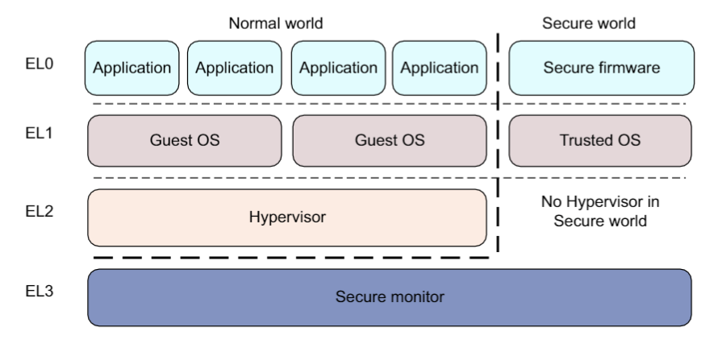

# 基于 Zynq US+ 的 ATF 应用

特权级是 ISA 的重要组成部分，在 AArch64 中的特权级被称为异常级别（Exception Level, EL），总共有四种特权级：

- EL0：最低级别的特权级，应用程序通常运行在该特权级，也称为用户态
- EL1：操作系统通常运行在该特权级，也称为内核态
- EL2：在虚拟化场景下，虚拟机监控器（Virtual Machine Monitor，VMM，通常运行在该特权级）
- EL3：和安全特性 TrustZone 相关，负责普通世界和安全世界之间的切换。

最近想要尝试在 Zynq US+ 上将 RT-SMART 运行起来， Zynq US+ 是基于 ARMv8 架构的 cortex-a53 内核多核处理器。该芯片刚启动时处于 EL3 级别，而当系统处于这个级别时，RT-Smart 是无法正常运行的，因此我们需要通过一些手段将芯片切换到 EL1 的非安全状态。

将系统从 EL3 级别切换到 EL1 的非安全状态的过程需要通过 ARM Trusted Firmware 来完成。

## 什么是 ARM Trusted Firmware 

ARMv8-A provides two security states, Secure and Non-secure. The Non-secure state is also referred to as the Normal World. This enables an Operating System (OS) to run in parallel with a trusted OS on the same hardware, and provides protection against certain software attacks and hardware attacks. ARM TrustZone technology enables the system to be partitioned between the Normal and Secure worlds. As with the ARMv7-A architecture, the Secure monitor acts as a gateway for moving between the Normal and Secure worlds.

