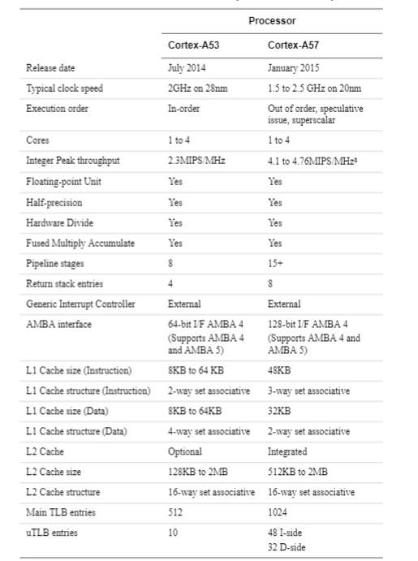
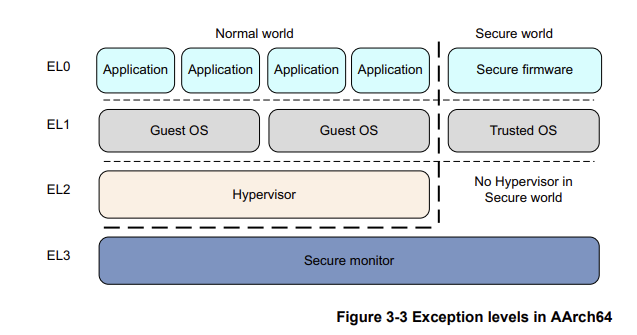
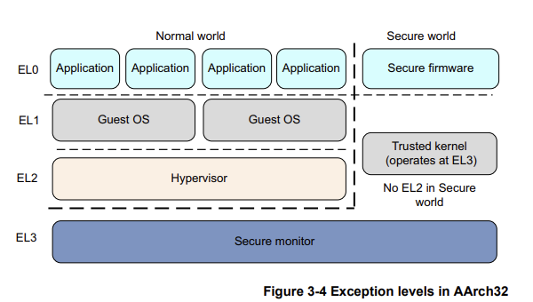
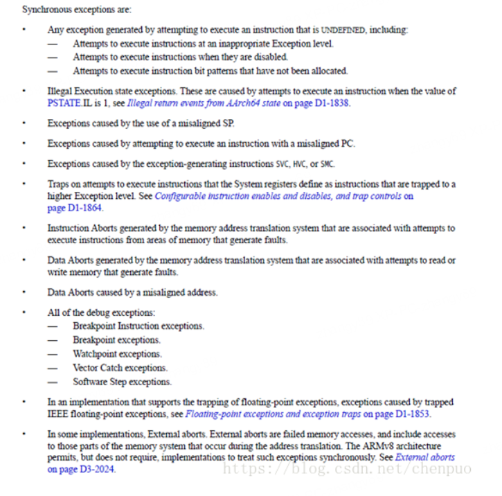
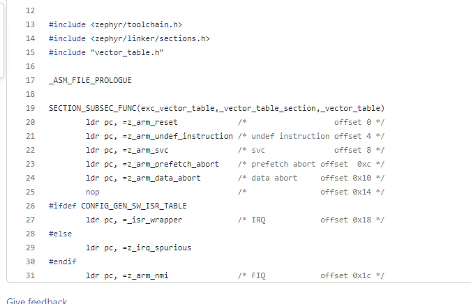
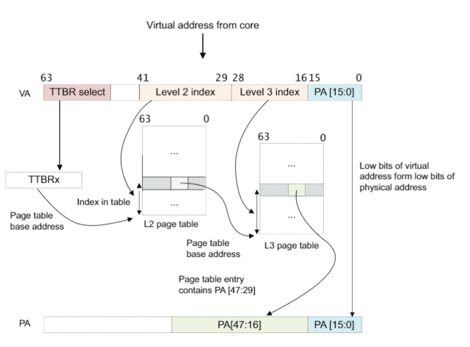
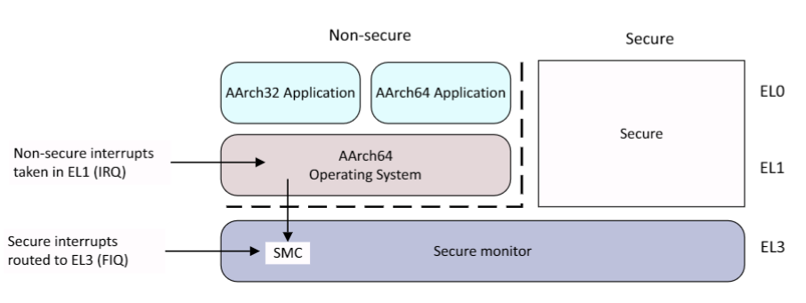
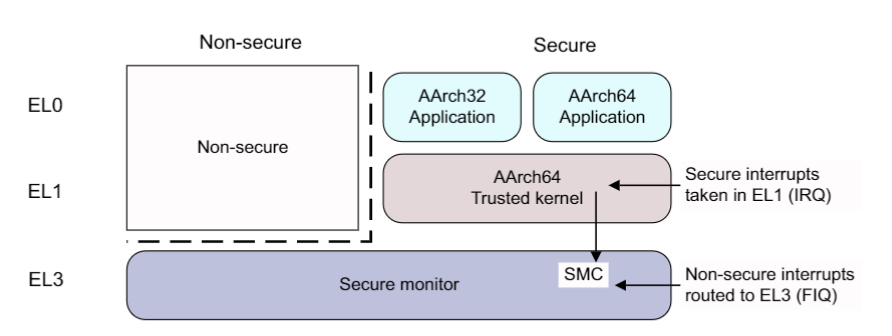
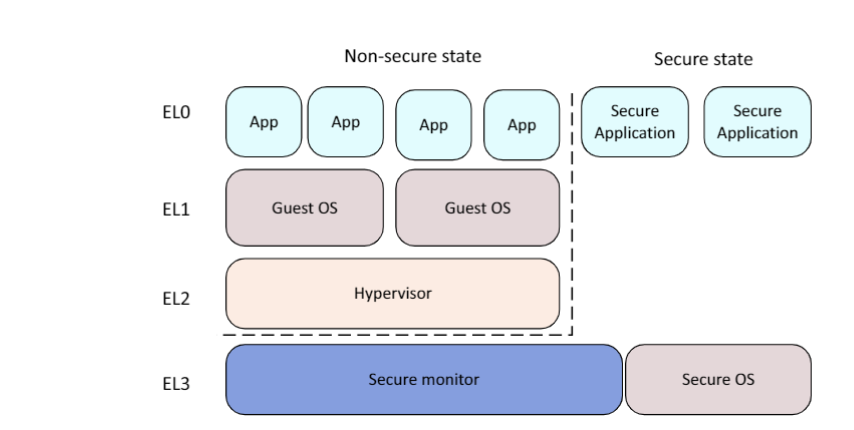
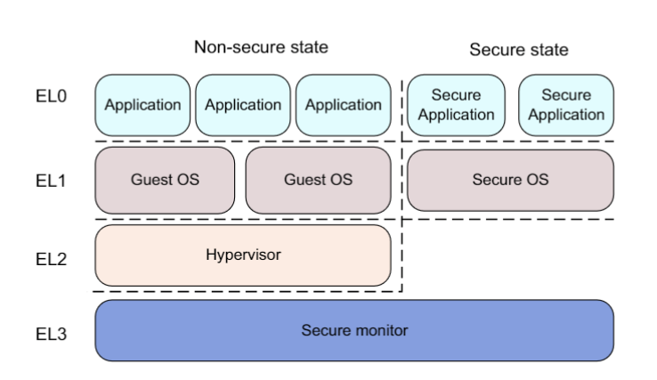

# ARMv8 架构编程探索

随着开发工作逐渐迁移到 ARMv8 的 64 位平台，因此有必要尽快熟悉 ARMv8 架构。ARMv8 与先前较为熟悉的 ARMv7 架构有较大变化，其中非常重要的一点是支持了 A64 指令集，大大提升了处理器的性能。从目前的的了解来看，基本上 ARMv8 与上代架构的差别非常大的。除了 A64 指令集之外，还有许多地方都有较大改动，下面列出几个目前比较关注的点：

- 执行状态与异常级别（异常级别为 EL0 - EL3）
- ARMv8 寄存器组（和先前完全不同的 64 位寄存器）
- A64 指令集（新的 64 位指令集）
- 内存管理（毕竟地址空间变成 64 位了）
- Memory Ordering
- 安全系统（例如普通世界和安全世界的切换）

本篇就依据上面的关键点对 ARMv8 架构进行一番探索。

## 架构基础


从上图可以看到，ARMv8 架构兼容了 ARMv7 架构的关键特性，例如支持 A32 和 T32 指令集，单精度浮点操作以及基于单精度浮点的 SIMD 指令。 ARMv7 为什么不支持双精度浮点的 SIMD 指令呢？也许是可用的浮点寄存器不够吧，AArch64 使用了 `32*128-bit` 的浮点寄存器，比 ARMv7 要多了一倍。

下图展示了后续要使用的 `Cortex-A53` 与 `Cortex-A57` 处理器属性：



可用看出，无论是 A53 还是 A57 的性能都远远超过先前的处理器性能，甚至 A57 架构还配备了专用的 GPU。

## 异常模型

### 执行状态与异常级别

在 ARMv8 架构中定义了两种执行状态，AArch64 以及 AArch32。这两种执行状态分别用于描述执行使用 64 位宽的通用寄存器或者使用 32 位宽的通用寄存器。虽然在 ARMv8 AArch32 中保留了 ARMv7 中定义的特权级，但是在 AArch64 中，特权级别由异常等级决定。因此在异常等级 `ELn` 执行代码时，对应于特权等级 `PLn`。

#### ARMv8-A AArch64



#### ARMv8-A AArch32



#### ARMv8-R AArch32


### 异常分类

针对 ARMv8 架构，异常主要分为两种：

- **Synchronous exceptions**

- **Asynchronous exceptions**

同步异常类型可能有很多原因，但它们以类似的方式处理。异步异常类型被细分为三种中断类型，IRQ，FIQ 和 `SError` (System Error)。

#### **Synchronous exceptions**

同步异常主要是由 CPU 自身执行指令时产生的，主要有以下场景：



#### **Asynchronous exceptions**

异步异常类型被细分为三种中断类型，分别是 IRQ、FIQ 和 `SError (System Error)`。IRQ 和 FIQ 是非常常见的异步异常，当发生异步的 abort 时会产生 `SError`。


### 异常触发源

#### **Aborts**

在 AArch64 中，异步的 abort 会造成一个 `SError` 中断异常。


#### **Reset**


#### **Exception generating instructions**


#### **Interrupts**


### 异常向量表

#### aarch32

当前 aarch32  系统中，主要分为 7 种异常类型，如下所示：



#### aarch64

当前 [Linux aarch64](https://github.com/torvalds/linux/blob/master/arch/arm64/kernel/entry.S) 系统中，主要分为 4 种异常类型，分别为：

- Synchronous

- `IRQ/vIRQ`

- `FIQ/vFIQ`

- `SError/VSError`

  


## ARMv8 寄存器组

AArch64 执行状态在所有的异常级别下提供了 31 个 64 位通用寄存器，每一个寄存器有 64 位宽，从 X0-X30。

下图展示了 AArch64 的 通用寄存器组与特殊寄存器：

### 通用寄存器组


### 特殊功能寄存器组


可以看出 AArch64 与先前的寄存器组有了非常大的变化，不仅通用寄存器组的宽度和个数变多了，特殊寄存器组也非常不同。特殊寄存器组最大的变化是，先前在 ARMv7 下各种不同模式下的 BANK 寄存器组都没有了，取而代之的是不同级别异常下的 SP 指针、SPSR 以及异常返回寄存器组。

------

同时为了兼容先前 ARMv7 下 AArch32 执行状态，支持从 AArch64 到 AArch32 寄存器组的映射，如下图所示：


- PSTATE at AArch32

在 AArch64 中，传统的 CPSR 寄存器被 PSTATE 取代。


### NEON 与浮点寄存器

除了通用寄存器组之外， ARMv8 也提供了 32 个 128 位的浮点寄存器组，V0-V31。这 32 个寄存器用户保存浮点操作数用于标量浮点执行或者标量和向量操作数用于 NEON 操作。

#### 标量寄存器大小


#### 向量寄存器大小


针对不同大小的向量操作：


#### NEON 在 AArch32 运行模式下

在 AArch32 中，小的寄存器被打包成更大的寄存器，例如 D0 和 D1 被组合成 Q1。这就引入了一些复杂的循环依赖关系，会降低编译器向量化循环结构的能力。


## ARMv8 指令集

ARMv8 架构最大的变化之一就是引入了额外的 64 位指令集，补充了现有的 32 位指令集架构。这一添加提供了访问 64 位宽的整数寄存器和数据操作，以及使用 64 位大小的指针访问内存的能力。新的指令集称为 A64，运行在 AArch64 执行状态。ARMv8 也包括先前的 ARM 指令集，现在叫做 A32 和 T32 指令集，这两种指令集都运行在 AArch32 状态，提供对 ARMv7 的先后兼容。

另外有一点需要注意的是，A64 指令集的操作码的长度仍然是 32 位，而不是 64 位。

### A64 指令集

A64 的指令助记符与 ARMv7 没有太大变化，只是所操作的寄存器形式不同， AArch64 寄存器有不同的位宽，但是我们并不需要记住不同形式的指令，汇编器会根据我们操作的寄存器名称自动选择合适的编码。

## 内存管理单元

MMU 的一个重要功能是使得系统可以运行多任务，作为一个独立的程序运行在它的私有虚拟地址空间上。这些独立程序不需要知道系统的物理内存映射，也就是那些实际被硬件使用的地址，也不用关心其他程序正在运行的程序。

有了 MMU ，我们可以使得每个应用程序都使用相同的虚拟地址。也可以使用连续的虚拟地址映射，即使这些物理内存是分离的。当将代码放置在内存中时，虚拟地址是那些被程序员、编译器和链接器使用的地址空间。而物理地址是那些被实际硬件系统使用的地址。


### 基于分页的虚拟内存

在 RT-Smart 操作系统中采用了基于分页机制的内存设计与实现，而页表是分页机制中的关键部分，负责记录虚拟页到物理页的映射关系，操作系统负责对页表进行配置。

在以往较简单的宏内核版本中，我们往往将虚拟地址和物理地址配置成一一映射，也就是说 CPU 尝试访问指定位置的虚拟地址，经过 MMU 翻译，实际上也访问了实际的物理地址。但是这种方式在支持多进程的 RT-Smart 中是不够的，要想支持多进程，就需要让不同进程在访问相同虚拟地址时，实际上访问了不同的物理地址。

在 AArch64 架构下，我们使用多级页表的方式来解决多进程的内存分配问题，常见的设置是虚拟地址低 48 位参与地址翻译，页表级数为 4 级，虚拟页大小为 4 KB。在这种情况下，物理内存被划分为连续的、4 KB 大小的物理页，一个虚拟页可以映射对应一个物理页。正因为页的大小为 4 KB，所以虚拟地址的低 12 位对应于页内偏移量。

#### 虚拟地址的翻译过程

建立页表是内存管理的一个关键过程，后续用一个专题来仔细研究一下 ARMv8 下多级页表的建立过程，下图展示了如何逐级查询页表最终找到一个正常的 64KB 物理页的过程。



每一个二级页表可以与一个或者多个一级页表所关联，我们可以用多个一级页表描述符指向同一个二级表，这也就是说可以让多个虚拟地址指向相同的物理地址。

#### 安全与非安全地址

从理论上来说，安全和非安全的物理地址空间是相互独立且同时存在的。一个系统可以被设计成有两个完全分离的内存系统。然而大部分实际的系统将安全和非安全当做一个访问控制的属性。普通世界只能访问非安全的物理地址空间。安全世界可以访问两种物理地址空间。这些访问权限是被转换表配置控制的。

## Memory Ordering

在操作系统的开发过程中，需要编写一些与硬件交互或者执行在其他核上的代码，或者直接加载或者写入要被执行的指令（例如加载应用程序），或者修改页表，在这些情况下都需要考虑内存访问顺序问题，也可以理解为观察值和实际执行情况的顺序差。

在上述情况下，程序员必须保证编写的代码有着清晰的内存访问顺序，可以通过正确地利用屏障（barriers）来实现这个目标。

在 ARMv8 架构中使用了内存弱序模型。总的来说，这就意味着内存访问的顺序并不用要求与程序的加载（load）和存储（store）操作一致。处理器可以重新调整内存读、写操作。这样做的结果是，使用一些硬件优化方法，例如 cache 和写缓冲区可以优化处理器的性能，这就意味着处理器和外部内存之间的带宽要求可以降低，而且与外部内存访问相关的延时可以被隐藏。

对普通内存的读写可以被硬件重新排序，只受数据依赖和显示的内存屏障指令的影响。在某些情况下需要更强的排序规则。程序员可以通通过描述该内存的转换表项的内存类型属性，向处理器核心提供相关信息。

一些非常高性能的系统支持包括内存读推测、多发指令或者乱序执行以及其他技术，提供了更进一步的可能性使得硬件重新调整内存访问顺序。

- 多条指令产生
- 乱序执行
- 执行预测
- 预测加载
- 加载和存储优化
- 外部内存系统
- 缓存一致性与多核处理
- 编译器优化

### 内存类型

所有的内存区域都被配置成两种类型之一，普通内存和设备内存。第三种内存类型，强序内存，是 ARMv7 架构的一部分。强序内存与设备内存的区别很小，因此在 ARMv8 中被省略了。

除了内存类型，属性还提供了对 cacheability、shareability、access 和执行权限的控制。可共享和可缓存属性仅适用于普通内存。设备区域永远是不能缓存和不能共享的。

### 屏障指令

ARM 架构在特定点使用屏障指令来强制指定访问顺序和访问完成。在一些其他架构中，也有类似的指令被称为 fence。

ARMv8 架构提供了三种类型的屏障指令：

- 指令同步屏障（ISB）

清空先前的指令流水线，例如 MMU 开启后指令和数据地址发生变化，上下文切换或者代码的位置被移动，需要执行 ISB 指令。

This is used to guarantee that any subsequent instructions are fetched, again, so that privilege and access are checked with the current MMU configuration. It is used to ensure any previously executed context-changing operations, such as writes to system control registers, have completed by the time the ISB completes. In hardware terms, this might mean that the instruction pipeline is flushed, for example. Typical uses of this would be in memory management, cache control, and context switching code, or where code is being moved about in memory.

- 数据内存屏障（DMB）

确保在下一次内存访问操作执行前，上一个内存访问已经完成了。

This prevents re-ordering of data accesses instructions across the barrier instruction. All data accesses, that is, loads or stores, but not instruction fetches, performed by this processor before the DMB, are visible to all other masters within the specified shareability domain before any of the data accesses after the DMB. For example:

```assembly
    LDR x0, [x1] // Must be seen by the memory system before the STR below.
    DMB ISHLD
    ADD x2, #1 // May be executed before or after the memory system sees 
    LDR.
    STR x3, [x4] // Must be seen by the memory system after the LDR above.
    It also ensures that any explicit preceding data or unified cache maintenance 
    operations have completed before any subsequent data accesses are executed.
    DC CSW, x5 // Data clean by Set/way
    LDR x0, [x1] // Effect of data cache clean might not be seen by this
    // instruction
    DMB ISH
    LDR x2, [x3] // Effect of data cache clean will be seen by this 
    instruction
```

- 数据同步屏障（DSB）

如果上一条内存访问操作有额外的效果，需要等这些效果完全生效后再进行后续的内存访问操作。

This enforces the same ordering as the Data Memory Barrier, but has the additional effect of blocking execution of any further instructions, not just loads or stores, or both, until synchronization is complete. This can be used to prevent execution of a SEV instruction, for instance, that would signal to other cores that an event occurred. It waits until all cache, TLB and branch predictor maintenance operations issued by this processor have completed for the specified shareability domain, For example:

```asm
DC ISW, x5 // operation must have completed before DSB can complete
STR x0, [x1] // Access must have completed before DSB can complete
DSB ISH
ADD x2, x2, #3 // Cannot be executed until DSB completes
```

### 内存属性

系统的内存内存映射被分为许多区域，每一个区域都需要不同的内存属性，例如对不同优先级、内存类型、缓存策略的读写访问权限。

内存属性还包括 cacheable 和 shareable，关于 shareable 细分下来还有 Non-shareable、Inner shareable、Outer shareable 以及 full system。

## 安全系统

一个系统提供一个特定的安全等级，一个受信的系统，是一个用来保护有价值的数据，例如密码和加密秘钥，信用卡数据，避免受到攻击，避免他们被复制、毁坏或者丢失。

在一个开放的系统中很难保证安全，因为在平台上会运行各种各样的软件，也会下载一些恶意的程序，这些程序可能会篡改系统。

ARM 处理器包括特殊的硬件扩展来构建一个受信的系统。软件以及硬件工具可以被分为如下三类：

- 软件攻击
- 简单硬件攻击
- 实验室硬件攻击

Trust Zone 技术就是被设计用于保护软件和简单硬件攻击。

### TrustZone 硬件架构

TrustZone 架构为系统设计者提供一种方法来帮助安全系统，使用 TrustZone 安全扩展和安全外设。ARM 安全模型分为设备硬件和软件资源，他们存在于安全世界为安全子系统，或者普通世界为非安全系统。系统硬件可以保证安全世界的数据都不可以被普通世界访问到。一个安全的设计会将所有敏感的资源放在安全世界。

### 利用中断切换安全世界

因为代码会在两个世界中执行，因此需要利用硬件的异常机制，通过 SMC 指令来进行环境切换。下图展示了在非安全世界的上下文切换过程：



下图展示安全世界中的上下文切换过程：



### 在安全态和非安全态切换

使用 ARMv7 安全扩展，monitor 模式被软件使用与在安全和非安全态进行切换。这个模式与其他模式在安全态下有着同等的优先级。

对于 ARMv8 架构，当 EL3 在使用 AArch32 系统时与 ARMv7 完全兼容，安全状态的特权模式运行在 EL3，如下图所示：



下图展示了在 AArch64 架构下使用 EL3 提供安全监视器的情况。在 EL3 态下是不能运行 AArch32 的，按时 EL1 可以用作安全操作系统。当 EL3 在使用 AArch64，EL3 级别被用于执行切换安全态与非安全态的代码，如下图所示：



关于 ARM 的安全状态，后续还是要仔细研究的，因为通过 ATF 将系统从 EL3 切换到 EL1 的非安全状态后，才可以正常的运行 RT-Smart 操作系统，所以对 ATF 的研究是必不可少的。


