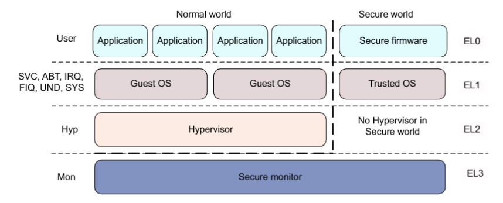
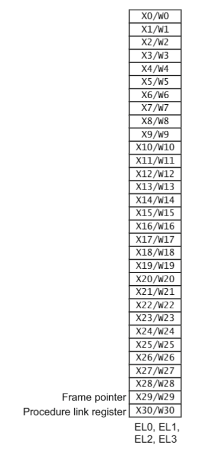
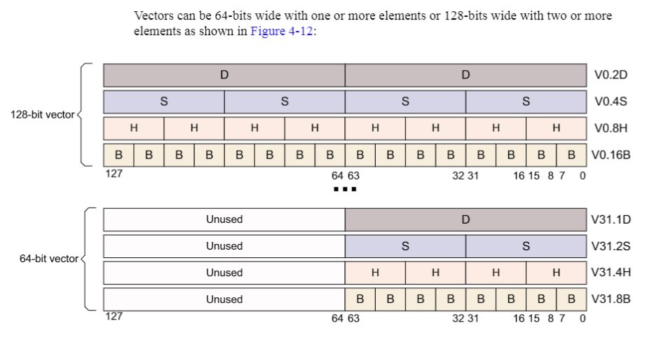
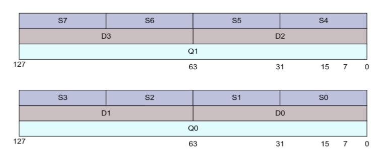

# ARMv8 架构编程探索

随着开发工作逐渐迁移到 ARMv8 的 64 位平台，因此有必要尽快熟悉 ARMv8 架构。ARMv8 与先前较为熟悉的 ARMv7 机构有较大的变化，其中非常重要的一点就是支持了 A64 指令集，大大提升了处理器的性能。从目前的的了解来看，基本上 ARMv8 与上代架构的差别是非常大的。除了 A64 指令集之外，还有许多地方都有了较大变化，下面列出几个目前比较关注的点：

- 执行状态与异常级别（异常级别为 EL0 - EL3）
- ARMv8 寄存器组（和先前完全不同的 64 位寄存器）
- A64 指令集（新的 64 位指令集）
- 内存管理（毕竟地址空间变成 64 位了）
- 安全系统（例如普通世界和安全世界的切换）

本篇就依据上面的关键点对 ARMv8 架构进行一番探索。

## ARMv8-A 架构基础

从上图可以看到，ARMv8 架构兼容了 ARMv7 架构的关键特性，例如支持 A32 和 T32 指令集，单精度浮点操作以及基于单精度浮点的 SIMD 指令。 ARMv7 为什么不支持双精度浮点的 SIMD 指令呢？也许是可用的浮点寄存器不够吧，AArch64 使用了 `32*128-bit` 的浮点寄存器，比 ARMv7 要多了一倍。

下图展示了后续要使用的 `Cortex-A53` 与 `Cortex-A57` 处理器属性：

可用看出，无论是 A53 还是 A57 的性能都远远超过先前的处理器性能，甚至 A57 架构还配备了专用的 GPU。

## 执行状态与异常级别

在 ARMv8 架构中定义了两种执行状态，AArch64 以及 AArch32。这两种执行状态分别用于描述执行使用 64 位宽的通用寄存器或者使用 32 位宽的通用寄存器。然而在 ARMv8 AArch32 中保留了 ARMv7 中定义的特权级，而在 AArch64 中，特权级通过异常等级被定义。因此执行在异常等级 `ELn` 对应于执行在特权等级 `PLn`。

在 AArch64 中，处理器模式在不同的异常等级间切换，就像指在 ARMv7（AArch32） 中当异常被处理时，处理器切换到相应的异常等级来处理异常。下图展示了两种架构在异常处理时的映射关系：

可以看出先前在 ARMv7 时有各种异常模式，而在 ARMv8 中，这些模式统统都属于 EL1 级别，处理的时候先进入 EL1 的处理函数，然后再通过寄存器信息判断现在发生了哪种异常，然后执行对应的处理函数。

## ARMv8 寄存器组

AArch64 执行状态在所有的异常级别下提供了 31 个 64 位通用寄存器，每一个寄存器有 64 位宽，从 X0-X30。

下图展示了 AArch64 的 通用寄存器组与特殊寄存器：

### 通用寄存器组

### 特殊功能寄存器组

可以看出 AArch64 与先前的寄存器组有了非常大的变化，不仅通用寄存器组的宽度和个数变多了，特殊寄存器组也非常不同。特殊寄存器组最大的变化是，先前在 ARMv7 下各种不同模式下的 BANK 寄存器组都没有了，取而代之的是不同级别异常下的 SP 指针、SPSR 以及异常返回寄存器组。

同时为了兼容先前 ARMv7 下 AArch32 执行状态，支持从 AArch64 到 AArch32 寄存器组的映射，如下图所示：

- PSTATE at AArch32

在 AArch64 中，传统的 CPSR 寄存器被 PSTATE 取代。

### NEON 与浮点寄存器

除了通用寄存器组之外， ARMv8 也提供了 32 个 128 位的浮点寄存器组，V0-V31。这 32 个寄存器用户保存浮点操作数用于标量浮点执行或者标量和向量操作数用于 NEON 操作。

#### 标量寄存器大小

#### 向量寄存器大小

针对不同大小的向量操作：

#### NEON 在 AArch32 运行模式下

在 AArch32 中，小的寄存器被打包成更大的寄存器，例如 D0 和 D1 被组合成 Q1。这就引入了一些复杂的循环依赖关系，会降低编译器向量化循环结构的能力。

## ARMv8 指令集

## 内存管理

## 安全系统

