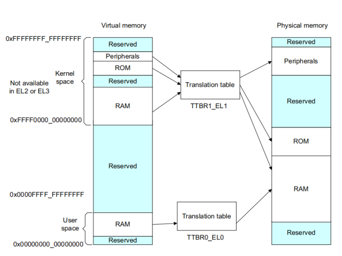

# MMU 基本原理详细分析

## 功能简介

MMU 的一个重要功能是使操作系统可以运行多任务，每一个独立的程序运行在自己私有的地址空间上。这些独立的程序不需要知道系统中的物理内存是如何分布的，也不需要知道哪些物理地址是实际被硬件使用的。

我们每个应用程序中使用相同的虚拟内存地址。我们可以可以使用一段连续的虚拟内存映射，即使真实使用的物理内存是碎片的。虚拟地址空间是与物理内存映射分离的，我们可以编译、链接应用程序运行在虚拟地址空间。

下面的示例系统展示了内存的虚拟地址和物理地址视图。操作系统通过配置 MMU 来进行两种内存视图的转换。

为了完成内存视图的转换，虚拟内存系统中的硬件必须提供地址翻译，也就是将处理器要访问的虚拟地址转换成在真实内存中的物理地址。

进行程序开发的时候，程序员、编译器和连接器使用虚拟地址，实际的硬件系统使用物理地址。

## 页表（Translation table）

MMU 使用虚拟地址的 **最高有效位**（MSB）来索引页表（Translation table）中的表项（entries），来确定哪一块内存正在被访问。MMU 转换代码和数据的虚拟地址到实际系统中的物理地址。这个转换过程由硬件自动执行，对于应用代码来说是透明的。

除了地址转换功能，MMU 还控制了内存的访问权限，memory ordering 和每一块内存区域的缓存策略。

## 原理分析

对于一个有 MMU 的 CPU 而言

