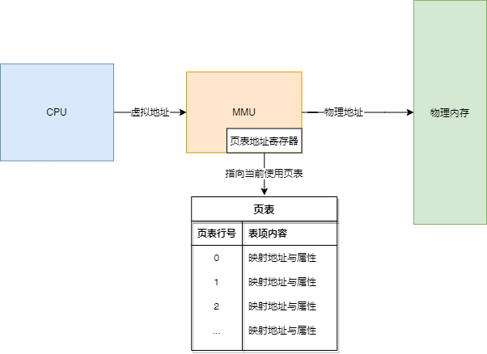
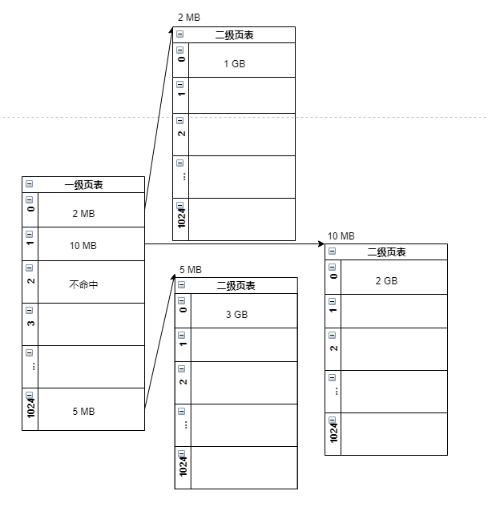

# MMU 基本原理详细分析

## 功能简介

MMU 的一个重要功能是使操作系统可以运行多任务，每一个独立的程序运行在自己私有的地址空间上。这些独立的程序不需要知道系统中的物理内存是如何分布的，也不需要知道哪些物理地址是实际被硬件使用的。

我们每个应用程序中使用相同的虚拟内存地址。我们可以可以使用一段连续的虚拟内存映射，即使真实使用的物理内存是碎片的。虚拟地址空间是与物理内存映射分离的，我们可以编译、链接应用程序运行在虚拟地址空间。

下面的示例系统展示了内存的虚拟地址（VA）和物理地址（PA）视图。操作系统通过配置 MMU 来进行两种内存视图的转换。

为了完成内存视图的转换，虚拟内存系统中的硬件必须提供地址翻译，也就是将处理器要访问的虚拟地址转换成在真实内存中的物理地址。

进行程序开发的时候，程序员、编译器和连接器使用虚拟地址，实际的硬件系统使用物理地址。

## 页表（Translation table）

MMU 使用虚拟地址的 **最高有效位**（MSB）来索引页表（Translation table）中的表项（entries），来确定哪一块内存正在被访问。MMU 转换代码和数据的虚拟地址到实际系统中的物理地址。这个转换过程由硬件自动执行，对于应用代码来说是透明的。

除了地址转换功能，MMU 还控制了内存的访问权限，memory ordering 和每一块内存区域的缓存策略。

## 页表映射详解

对于一个有 MMU 的 CPU 来说，MMU 开启后，CPU 在任何时候想要访问的都是虚拟地址，这个虚拟地址发给 MMU 后，MMU 通过页表查询这个虚拟地址对应的物理地址在哪，然后从内存条里访问真实的物理内存。MMU 里面的页表地址寄存器，记录了页表本身的存放位置。

### 一级页表映射分析

以 32 位系统举例，假设只使用一级页表，页表的每一行占用 32 bit 空间，页表内容如下所示：

| 行号                | 物理地址    | 是否命中 | RWX 权限 | user/kernel 权限 |
| ------------------- | ----------- | -------- | -------- | ---------------- |
| 0                   |             | 否       |          |                  |
| 1                   | 6 MB        | 是       | RX       | U + K            |
| 2                   | 8 MB        | 是       | RX       | U + K            |
| 3                   | 3 MB        | 是       | RW       | U + K            |
| ... 省略中间行号    |             |          |          |                  |
| `3GB / 4KB`         | 0 MB        | 是       | RX       | K                |
| `(3GB + 4KB) / 4KB` | 0 MB + 4 KB | 是       | RX       | K                |
| ...                 |             |          |          |                  |

#### 虚拟地址访问示例

上面介绍页表时有提到，MMU 使用虚拟地址的最高有效位作为索引来查询页表，在这个例子中，MMU 使用虚拟地址的高 20 位作为页表行号的索引，下面举例分析。

#####  访问虚拟地址 0 

当 CPU 访问虚拟地址 0 时，MMU 会去查询上面页表的第 0 行（`0KB/4KB = 0`，VA 的高 20 位值为 0），发现第 0 行没有命中，于是此时无论是想以何种方式（读、写、执行）访问内存，都会出错，此时 MMU 会给 CPU 发送 page fault，CPU 发现访问错误就自动跳转到 fault 的代码去处理 fault。

#####  访问虚拟地址 `4K`

当 CPU 访问虚拟地址 `4K` 时，MMU 会去查上面页表的第 1 行（`4KB/4KB = 1`，VA 的高 20 位值为 1），发现第一行命中，如果这个时候执行读写操作，情况如下：

- 用户执行读或者执行，则 MMU 会去访问物理内存 `6 MB` 的地址，因为页表里面记录该页的读写权限是 RX

- 用户执行写操作，由于页表里面第 1 行记录的权限是 RX，没有记录用户有写的权限，MMU 会给 CPU 发出 page fault，CPU 自动跳转到 fault 的代码去处理 fault

#####  访问虚拟地址 `8KB + 16`

当 CPU 访问虚拟地址 `8KB + 16` 的时候，MMU 会查页表的第 2 行（`8KB/4KB = 2`，此时虚拟地址的高 20 位值为 2），发现第 2 行命中了物理地址 8 MB ，此时 MMU 会先检查访问权限，根据检查结果访问  `8M + 16` 这个物理地址。

#####  访问虚拟地址 `3GB`

当 CPU 访问虚拟地址 `3GB` 的时候，MMU 会去查页表的第  `3GB/4KB` 行，表中记录该物理地址是命中了，查到相对应的物理地址是 0，于是 MMU 去访问物理地址 0。而此时由于访问权限的不同，分为两种情况：

- CPU 在执行用户态应用程序的时候，去访问 `3GB`，由于页表里面记录的 U+K 权限只有 K，所以用户态程序是没有访问权限的，MMU 会向 CPU 发出 page fault，CPU 自动跳转到 fault 的代码去处理 fault
- CPU 在执行内核态程序的时候，去访问 `3GB`，由于在页表里面记录的 U+K 权限有 K，所以内核是有权限访问该内存的，这种情况下 MMU 不会报错，程序正常执行

#### 页表内存占用

从以上分析可知，在使用一级页表的情况下，每 `4KB` 的虚拟地址就需要页表里的一行（32 bit） 来存储其映射信息，那么在 32 位地址空间下，页表的大小就为 `(4GB/4KB) * 4 byte = 4MB` 。也就是说，每个页表所需要的存储空间是 `4MB`，这么一看似乎占用内存也不算是很多，但是你仔细想一下，内核态需要独立的页表，每个进程也都需要一个独立页表，这样算下来实在是消耗了太多内存。

在只使用一级页表的情况下，页表大小是 `4MB`，覆盖了整个 `0 - 4GB` 的虚拟地址空间，任何一个虚拟地址都可以用地址的高 20 位（页大小为 `4k`，低 12 位作为页内偏移）作为行号在页表中查找对应的页表项，找到对应的物理地址。

当 CPU 访问虚拟地址时，这个查表过程是由硬件 MMU 自动完成的。

#### 页表切换

现在假设我们的操作系统中有两个进程，分别是进程 1 和进程 2，他们的页表分别如下：

- 进程 1 的页表，物理地址在 255 MB

| 行号                | 物理地址    | 是否命中 | RWX 权限 | user/kernel 权限 |
| ------------------- | ----------- | -------- | -------- | ---------------- |
| 0                   |             | 否       |          |                  |
| 1                   | 6 MB        | 是       | RX       | U + K            |
| 2                   | 8 MB        | 是       | RX       | U + K            |
| 3                   | 3 MB        | 是       | RW       | U + K            |
| ... 省略中间行号    |             |          |          |                  |
| `3GB / 4KB`         | 0 MB        | 是       | RX       | K                |
| `(3GB + 4KB) / 4KB` | 0 MB + 4 KB | 是       | RX       | K                |
| ...                 |             |          |          |                  |

- 进程 2 的页表，物理地址在 280 MB

| 行号                | 物理地址    | 是否命中 | RWX 权限 | user/kernel 权限 |
| ------------------- | ----------- | -------- | -------- | ---------------- |
| 0                   |             | 否       |          |                  |
| 1                   | 100 MB      | 是       | RX       | U + K            |
| 2                   | 200 MB      | 是       | RX       | U + K            |
| 3                   | 300 MB      | 是       | RW       | U + K            |
| ... 省略中间行号    |             |          |          |                  |
| `3GB / 4KB`         | 0 MB        | 是       | RX       | K                |
| `(3GB + 4KB) / 4KB` | 0 MB + 4 KB | 是       | RX       | K                |
| ...                 |             |          |          |                  |

当 CPU 在执行进程 1 的时候，操作系统会把进程 1 的页表的物理地址 255 MB，填入 MMU 的页表地址寄存器，此时进程 1 的页表生效。根据页表内容， CPU 如果访问 4 KB 这个虚拟地址的话，MMU 将会访问物理内存的 6 MB 地址。CPU 如果访问 8 KB 这个虚拟地址的话，MMU 访问物理内存的 8 MB 地址。CPU 如果访问 3 GB 这个虚拟地址的话，MMU 访问物理内存的 0 MB 地址。

当 CPU 在执行进程 2 的时候，操作系统会把进程 2 的页表的物理地址 280 MB，填入 MMU 的页表地址寄存器，此时进程2 的页表生效，进程 1 的页表失效。根据页表内容，CPU 如果访问 4 KB 这个虚拟地址的话，MMU 将会访问物理内存的 100 MB 地址。CPU 如果访问 8 KB 这个虚拟地址的话，MMU 将访问物理内存的 200 MB 地址。CPU 如果访问 3 GB 这个虚拟地址的话，MMU 访问物理内存的 0 MB 地址。

从上面的分析可以得知，进程 1 和进程 2 去访问 3 GB 虚拟地址的时候，最终 MMU 访问的物理地址都是 0 MB，这是因为在进程 1 和进程 2 这两个进程的页表中，`3GB/4KB`  这一项的**内容是完全相同的**。

### 多级页表映射分析

如果采用一级页表的话，每个进程都需要一个 4MB 的页表。这种方式浪费了很多内存空间用于存放页表，在实际的应用中往往使用多级页表。假设我们用虚拟地址的高 10 位作为一级页表的索引，中间 10 位作为二级页表的索引，低 12 位用于页内偏移。

此时如果 CPU 要访问虚拟地址 20，这个地址分解为 10/10/12 位的话，如下图所示：

此时 MMU 会使用 0 作为索引去访问一级页表（一级页表的地址填入 MMU 的页表地址寄存器）的第 0 行，第 0 行的内容写的是 2MB（此时不再是内存的物理地址，而是二级页表所在的物理地址）说明二级页表的存放在物理地址的 2 MB 处，接下来 MMU 自动使用中间 10 位作为二级页表索引去查询物理地址在 2 MB 的二级页表，最终查到第 0 行这个虚拟地址对应的物理地址是 1GB，于是 MMU 去访问物理内存的 （1GB + 20） 这个物理地址。

查询过程如下图所示：

从以上分析可知，一级页总共有 $$2^{10}$$ 即 1024 项，每一项占用 4 个字节内存，因此总内存占用为 4K。每个二级页表也是 1024 项，每项占用 4 个字节，也是 4KB。分级机制的好处在于，如果一级页表中的部分表项不命中，那么也就不需要这部分的二级页表了，于是就省掉了这部分页表所占用的内存（4KB）。

页表还可以分更多级，但无论多少级，其原理都是一致的，不同的地方就在于如何划分虚拟地址的位数来不同级别的页表进行索引。

在使用多级页表的时候，MMU 只需要知道一级页表的基地址即可。每次进行进程上下文切换时，把新进程的一级页表地址填入MMU 的页表基址寄存器，然后激活新页表，即可完成页表切换。

## 总结

虚拟地址到物理地址的转换过程，本质上就是 MMU 硬件自动通过页表查询对应物理地址的过程。操作系统中很多地方会频繁使用到虚拟地址的映射和解映射，例如：

- 进程的创建与退出
- 进程申请和释放内存
- 进程访问外设时

充分理解 MMU 的静态映射规则对后续理解操作系统的内存管理功能会有很大帮助。