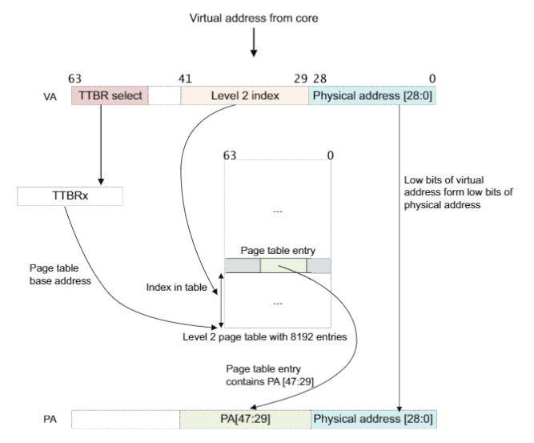
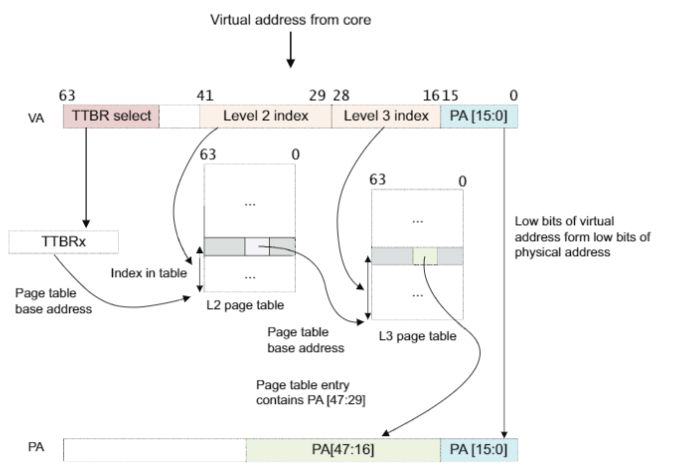

# AArch64 虚拟地址映射详解

## 内核与应用地址隔离

一般来说在操作系统之上会有多个应用程序或者任务同时运行。每一个任务都有自己独立的页表，在进程上下文切换的过程中，也会进行页表的切换。然而，大部分内存系统只被内核所使用，并且有着固定的虚拟地址到物理地址的映射，这些页表项很少被修改。ARMv8 架构提供许多特性来高效地处理这种问题。

页表基地址被页表基址寄存器 TTBR0_EL1 和 TTBR1_EL1 指定。 当访问的虚拟地址高位全为 0 时，TTBR0 所指向的页表被选中。当虚拟地址的高位全为 1 时，TTBR1 所指向的页表被选中。

处理器获取指令或者读取数据访问的虚拟地址都是 64 位的，但是我们需要将虚拟内存映射到两部分内存区域，这两部分区域分别有 48 位地址空间。

EL2 和 EL3 都有 TTBR0，但是没有 TTBR1，这就意味着：

- 如果 EL2 运行在 AArch64，可以访问的虚拟地址范围为 `0x0 - 0x0000FFFF_FFFFFFFF`
- 如果 EL3 运行在 AArch64，可以访问的虚拟地址范围为 `0x0 - 0x0000FFFF_FFFFFFFF`

内核空间被映射到虚拟地址空间的高位地址，每一个应用被映射到虚拟地址空间的低位地址。然而，这两部分虚拟地址都要被映射到一个小得多的物理地址空间，如下图所示：

## TCR_EL1 寄存器配置

TCR_EL1 寄存器，Translation Control Register TCR_EL1 定义了最高有效位长度字段（用于分辨用户空间与内核空间），TCR_EL1 包括了大小区域 T0SZ[5:0] 和 T1SZ[5:0]。这个字段里的整数大小指定了虚拟地址的最高有效位有多少位是全 0 或者全 1。有的字段规定了最大最小值，表示物理页大小以及页表级数。因此在所有的操作系统中，都必须使用两部分空间和至少两个页表。

Intermediate Physical Address Size (IPS) 字段控制了最大输出的地址范围。如果转换过程输出的地址超出了这个范围，那么访问就会导致 faulted。000 表示 32 位物理地址，101 表示 48 位物理地址。Two-bit Translation Granule (TG) TG1 and TG0 字段分别指定了内核与用户空间的物理页粒度大小，00  表示 4KB，01 表示 16KB，11 表示 64KB。

可以通过该寄存器配置页表的等级。整个虚拟地址转换过程需要三级或者四级页表。但是不需要实现所有的级别。页表的级数被物理页粒度和 `TCR_ELn.TxSZ` 字段定义。

## 虚拟地址到物理地址转换

当处理器为了读取指令，访问数据而发出一个 64 位的虚拟地址时，MMU 硬件会将这个虚拟地址转换为相应的物理地址。一个虚拟地址的高 16 位 [63:48] 必须全为 0 或者全为 1，否则这个地址就会触发一个 fault。

虚拟地址的低有效位被用作被选中段的偏移量，这样 MMU 就可以将页表块中的物理地址和虚拟地址的低有效位结合起来，获取最终的物理地址。

ARMv8 架构提供标记地址功能。也就是虚拟地址的高 8 位被忽略（不作为地址的一部分）。这就意味着这些比特位可以用于其他方面，例如记录指针的一些信息。

### 一级页表转换

下图展示了一个 512 MB 内存块的虚拟地址到物理地址转换：

在一个只使用一级表查找的地址翻译过程中，假设我们使用 64 KB 的物理页大小，使用 42 位虚拟地址。MMU 转换一个虚拟地址的过程如下所示：

1. 如果 VA[63:42] = 1，那么 TTBR1 作为一级页表的基地址。如果 VA[63:42] = 0，那么 TTBR0 将作为一级页表的基地址。
2. 页表包含 8192 个 64 位页表项，使用 VA[41:29] 作为索引来访问。MMU 从页表中读取相关的二级页表项。
3. MMU 检查页表项是否有效，且是否有内存访问权限。如果有效，则本次内存访问是被允许的。
4. 在上图中，页表项指向了一个大小为 512 MB 的页。
5. 页表项的 [47:29] 位被取出来，作为物理地址的 [47:29] 位。
6. 因为我们的页大小为 512 MB，因此虚拟地址的 [28:0] 被取出作为物理地址的 [28:0] 位。
7. 伴随着页表项中额外的信息，返回一个完整的物理地址 PA[47:0] 。

### 多级页表转换

实际上，上面这种简单的转换过程严重地限制了程序员合理地划分地址空间。一级页表的表项可以指向一个二级页表，取代只使用一级页表的情况。

通过这种方式，操作系统可以更进一步划分一个大的虚拟内存段为更小的页。对于一个二级页表来说，第一级页表的描述符包含了二级页表的物理地址。处理器想要访问的虚拟地址所对应的物理地址，被保存在二级页表的描述符中。

下图展示了一个 64KB 的内存块使用二级页表从虚拟地址到物理地址的转换：

每一个二级表可以与一个或多个一级表项相关联。可以有多个以及表描述符指向相同的二级页表，这就意味着可以做到使多个虚拟地址映射到相同的物理地址。

上图的翻译过程使用了二级查找，这里假设页大小为 64 KB，且虚拟地址空间为 42 位，转换过程如下：

1. 如果 VA[63:42] = 1 那么 TTBR1 被用作第一级页表的基地址。当 VA[63:42] = 0，TTBR0 被当做第一级页表的基地址。
2. 一级页表包含 8192 项 64 位的页表项，通过 VA[41:29] 来寻址。MMU 通过一级页表读取二级页表相关的表项。
3. MMU 检查一级页表的表项判断其是否有效，内存访问是否允许。如果访问是有效的，那么本次内存访问被允许。
4. 一级页表项指向二级页表。
5. 一级页表项的 [47:16] 位组成了二级页表的基地址。
6. 虚拟地址的 [28:16] 位用于索引二级页表，MMU 从二级页表中读取相关的表项。
7. MMU 检查二级页表的表项判断其是否有效，本次内存访问是否被允许。如果访问是有效的，那么本次内存访问被允许。
8. 二级页表的表项指向一个 64 KB 的页。
9. 二级页表项的 [47:16] 位被取出作为物理地址的 [47:16] 位。
10. 因为页大小为 64KB，虚拟地址的 [15:0] 位被取出作为物理地址的 [15:0] 位。
11. 伴随着页表项中的附加信息，返回一个完整的物理地址 [47:0]。   

### 注意事项

上面的流程描述了多级页表情况下 MMU 翻译虚拟地址的过程，值得注意的是，从一级页表中读取二级页表的基地址的过程。尝试从一级页表的 [47:16] 位获得二级页表的基地址，这里从一级页表项中总共取出了 32 位地址，那么这 32 位地址怎么会足够查找二级页表的基地址呢？明明物理地址空间为 64 位呢（其实是 48 位，因为地址总线为 48 位）。

其实这里之所以可以使用从一级页表中取出的 32 位地址来找到二级页表，是基于以下假设：

- 二级页表基地址是对齐与其自身大小的，例如 4k，1k 等

如果页表自身是对齐的，那么只要在一级页表中取出的地址后面补 0，组成一个完成的地址，就可以找到下一级页表了。

## 页大小为 4K 的映射

不同粒度的页大小会影响页表的数量和大小，下面以页大小为 4k 为例，分析如何划分虚拟地址，以及如何建立页表来完成地址映射。

当使用 4k 粒度的页大小时，硬件可以使用 4 级查找过程。48 位的地址可以划分为每一级 9 位的转换，每一级有 512 项，最低 12 位用于选择在 4KB 物理页内的一个字节。

- L0 页表的 512 个页表项，VA[47:39] 位用于用于索引 L0 页表，每个表项可以表示 512 GB 的地址空间，指向 L1 页表
- L1 页表有 512 个页表项，VA[38:30] 位用于索引 L1 页表，每个表项指向 1 GB 的内存块或者 L2 页表
- L2 页表有 512 个页表项，VA[29:21] 位用于索引 L2 页表，每个表项指向 2 MB 的内存块或者下一级页表
- L3 页表是最后一级，有 512 个页表项，VA[20:12] 位用于索引 L3 表项，指向一个 4KB 的内存块
- VA[11:0] 用于页内偏移，指向某一个 byte

虚拟地址划分如下图所示：

## 总结

以上内容讲解了在 AArch64 架构下内核与用户地址的隔离机制，以及实现虚拟地址与物理地址转换的原理，对理解编程实现静态或者动态虚拟地址映射都有很大帮助。