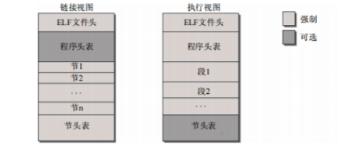

# ELF 应用程序加载运行过程分析

在用户态应用程序处理的任务中，elf 加载运行是一个比较重要的步骤，下面就分析一下在 RT-SMART 操作系统中，想要将一个应用程序运行起来要经过哪些步骤。

## ELF 格式介绍

ELF 代表 Executable and Linkable Format。它是一种对可执行文件、目标文件和库使用的文件格式。它在 Linux 下成为标准格式已经很长时间，ELF 一个特别的优点在于，同一文件格式可以用于内核支持的几乎所有体系结构上。

RT-SMART 同样也使用 ELF 作为可执行文件的格式，下面简单介绍一下 ELF 文件格式。

### ELF 文件布局和结构

下图为 ELF 文件的基本布局：

上图展示了 elf 文件的重要组成部分：

- elf 文件头，除了用于标识ELF文件的几个字节之外，ELF头还包含了有关文件类型和大小的有关信息，以

  及文件加载后程序执行的入口点信息。

- 程序头表（program header table）向系统提供了可执行文件的数据在进程虚拟地址空间中组织

  方式的相关信息。它还表示了文件可能包含的段数目、段的位置和用途。

- 各个段保存了与文件相关的各种形式的数据。例如，符号表、实际的二进制码、固定值(如字

  符串)或程序使用的数值常数。

- 节头表（section header table）包含了与各段相关的附加信息。

使用 readelf 工具可以读取该类型文件中的各种数据结构。

## 关键数据结构

### elf 加载数据结构

下面是在 elf 加载过程上下文数据结构，这个结构中包括了 eheader、pheader 和 sheader 三个 elf 的关键数据结构。

```c
struct elf_load_context
{
    int fd;

    int len;
    uint8_t *load_addr;

    struct rt_lwp *lwp;
    struct process_aux *aux;

    rt_mmu_info *m_info;

    Elf_Ehdr eheader; /* elf 头表 */
    Elf_Phdr pheader; /* 程序头表 */
    Elf_Shdr sheader; /* 节头表   */

    /* 0 for text section and 1 for data section */
    struct map_range user_area[2]; 
};
```
### elf 头表

```c
typedef struct
{
    unsigned char e_ident[EI_NIDENT]; /* Magic number and other info */
    Elf64_Half    e_type;         /* Object file type */
    Elf64_Half    e_machine;      /* Architecture */
    Elf64_Word    e_version;      /* Object file version */
    Elf64_Addr    e_entry;        /* 程序入口点 */
    Elf64_Off     e_phoff;        /* 程序头表在二进制文件中的偏移量 */
    Elf64_Off     e_shoff;        /* 节头表所在的偏移量 */
    Elf64_Word    e_flags;        /* 特定于处理器的标志 */
    Elf64_Half    e_ehsize;       /* 了ELF头的长度，单位为字节 */
    Elf64_Half    e_phentsize;    /* 了程序头表中一项的长度，单位为字节（所有项的长度都相同） */
    Elf64_Half    e_phnum;        /* 程序头表中项的数目 */
    Elf64_Half    e_shentsize;    /* 节头表中一项的长度，单位为字节（所有项的长度都相同） */
    Elf64_Half    e_shnum;        /* 节头表中项的数目 */
    Elf64_Half    e_shstrndx;     /*包含各节名称的字符串表在节头表中的索引位置 */
} Elf64_Ehdr;
```

### 程序头表

```c
typedef struct
{
    Elf64_Word    p_type;         /* Segment type */
    Elf64_Word    p_flags;        /* Segment flags */
    Elf64_Off     p_offset;       /* Segment file offset */
    Elf64_Addr    p_vaddr;        /* Segment virtual address */
    Elf64_Addr    p_paddr;        /* Segment physical address */
    Elf64_Xword   p_filesz;       /* Segment size in file */
    Elf64_Xword   p_memsz;        /* Segment size in memory */
    Elf64_Xword   p_align;        /* Segment alignment */
} Elf64_Phdr;
```

### 节头表

```c
typedef struct
{
    Elf64_Word    sh_name;        /* Section name (string tbl index) */
    Elf64_Word    sh_type;        /* Section type */
    Elf64_Xword   sh_flags;       /* Section flags */
    Elf64_Addr    sh_addr;        /* Section virtual addr at execution */
    Elf64_Off     sh_offset;      /* Section file offset */
    Elf64_Xword   sh_size;        /* Section size in bytes */
    Elf64_Word    sh_link;        /* Link to another section */
    Elf64_Word    sh_info;        /* Additional section information */
    Elf64_Xword   sh_addralign;   /* Section alignment */
    Elf64_Xword   sh_entsize;     /* Entry size if section holds table */
} Elf64_Shdr;
```

