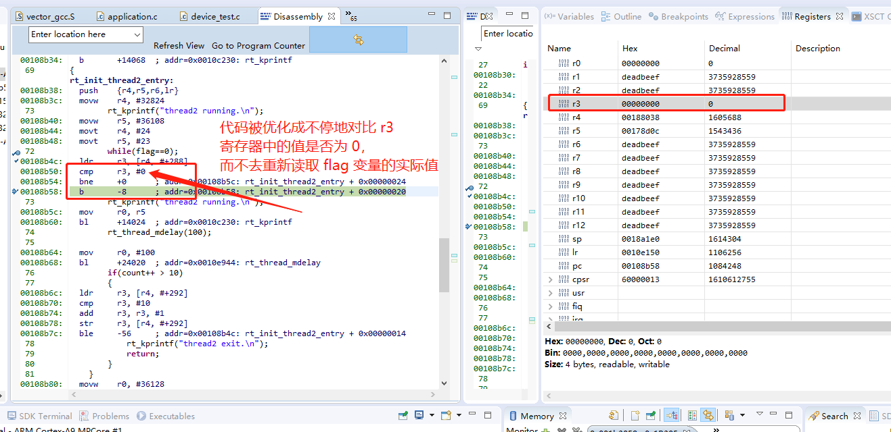

# volatile 的使用说明

By declaring an object volatile, the compiler is informed that the value of the object can change beyond the compiler’s control. The compiler must also assume that any accesses can have side effects—thus all accesses to the volatile object must be preserved.

There are three main reasons for declaring an object volatile:

- Shared access; the object is shared between several tasks in a multitasking environment
- Trigger access; as for a memory-mapped SFR where the fact that an access occurs
has an effect
-  Modified access; where the contents of the object can change in ways not known to
the compiler.

## Shared access

the object is shared between several tasks in a multitasking environment。

当同一**全局变量**在多个线程之间被共享时，有可能会出现同步错误，编译器可能会将访问该全局变量的代码优化为访问某个寄存器，而不会再次访问相应的内存，导致程序运行错误。

测试代码如下：

```c
static struct rt_thread v_thread1;
static char v_thread1_stack[8192];
static struct rt_thread v_thread2;
static char v_thread2_stack[8192];

static int flag;
static int count;

static void rt_init_thread1_entry(void *parameter)
{
    while(1)
    {
        rt_thread_mdelay(300);
        flag = 1;
        rt_thread_mdelay(300);
        flag = 0;

        if(count++ > 10)
        {
            rt_kprintf("thread1 exit.\n");
            flag = 1;
            return;
        }
    }
}

static void rt_init_thread2_entry(void *parameter)
{
    while(1)
    {
        while(flag==0);
        rt_kprintf("thread2 running.\n");
        rt_thread_mdelay(100);

        if(count++ > 10)
        {
            rt_kprintf("thread2 exit.\n");
            return;
        }
    }
}

int volatile_test()
{

    rt_err_t result = RT_EOK;
    result = rt_thread_init(&v_thread1, "vth1",
                            rt_init_thread1_entry,
                            RT_NULL,
                            v_thread1_stack, sizeof(v_thread1_stack),
                            RT_THREAD_PRIORITY_MAX / 3 - 1 , 20);
    if (result == RT_EOK)
        rt_thread_startup(&v_thread1);

    result = rt_thread_init(&v_thread2, "vth2",
                            rt_init_thread2_entry,
                            RT_NULL,
                            v_thread2_stack, sizeof(v_thread2_stack),
                            RT_THREAD_PRIORITY_MAX / 3, 20);
    if (result == RT_EOK)
        rt_thread_startup(&v_thread2);

    return 0;

}
MSH_CMD_EXPORT(volatile_test, run volatile_test);
```

上面的测试代码在 O0 优化时正常运行，打印结果如下：

```
msh />volatile_test
thread2 running.
msh />thread2 running.
thread2 running.
thread2 running.
thread2 running.
thread2 running.
thread2 running.
thread2 running.
thread2 running.
thread2 exit.
thread1 exit.
```

但是如果开启 O3 优化，则打印结果如下：

```
msh />volatile_test
thread1 exit.
```

也就是说 thread2 永远得不到运行，那么原因是什么呢，请看下图的反汇编，语句

```
while(flag==0);
```

被优化成了如下汇编：

```
00108b4c:   ldr     r3, [r4, #+288] # 第一次读取 flag 的实际值到 r3
00108b50:   cmp     r3, #0          # 对比 r3 的值是否为 0
00108b54:   bne     +0      ;       # 如果不为 0 则跳转
00108b58:   b       -8      ;       # 再次跳转回 cmp 语句继续循环
```

也就是说，整个程序被翻译成，只读取一次 flag 的实际值，后续一直使用 r3 寄存器中的值来进行对比，而第一次读取到的 r3 值为零，因此 while 的条件将永远成立，thread2 永远也得不到执行。



## Trigger access

as for a memory-mapped SFR（特殊功能寄存器）where the fact that an access occurs has an effect。

当读取类似串口设备的数据寄存器时，一定要加上 volatile，因为该地址寄存器中的数值可能会发生改变，如果不加 volatile，可能会发现读取的数据是错误的。

## Modified access

where the contents of the object can change in ways not known to the compiler.

对象的内容可能会被以编译器不清楚的方式被修改，例如在内核态与用户态的程序在不同的虚拟地址访问同一块物理内存，此时如果不加上 volatile，则外部的修改无法被感知到，造成程序错误。

## 关于优化错误

如果系统在低优化等级能正常运行，但是在高优化的情况下的无法正常运行，首先怀疑两个方面：

- 是否是一些关键操作没有添加 volatile
- 是否是有内存写穿（因为不同的优化等级改变了内存排布导致写穿位置发生改变）

## 如何避免关键操作被优化

### 情况一

如果发现加上了 `printf` 打印，或者调用了某个外部函数，系统就正常运行了，也要怀疑是否出现了变量访问被优化的情况，因为如果加上了**外部函数**（非本文件中的函数或其他库中的函数）调用，则编译器无法确定被引用的变量是否被外部函数所改变，因而会自动从原有地址重新读取该变量的值。

如果修改上面的测试代码，在 while 循环中加入 `rt_kprintf` 打印如下：

```c
while(flag==0)
{
    rt_kprintf("5\n");
}
```

则程序仍然正常运行，原因就是编译器不知道 `rt_kprintf` 函数是否会修改 flag 变量，因此编译器会尝试每次都重新读取 `flag` 的值。

### 情况二

还可以使用另外一种方式来解决这个问题，如下：

```c
while(flag==0)
{
    asm volatile ("":::"memory");
}
```

```
Some instructions clobber some hardware registers. We have to list those registers in the clobber-list, ie the field after the third ’:’ in the asm function. This is to inform gcc that we will use and modify them ourselves. So gcc will not assume that the values it loads into these registers will be valid. We shoudn’t list the input and output registers in this list. Because, gcc knows that "asm" uses them (because they are specified explicitly as constraints). If the instructions use any other registers, implicitly or explicitly (and the registers are not present either in input or in the output constraint list), then those registers have to be specified in the clobbered list.

If our instruction can alter the condition code register, we have to add "cc" to the list of clobbered registers.

If our instruction modifies memory in an unpredictable fashion, add "memory" to the list of clobbered registers. This will cause GCC to not keep memory values cached in registers across the assembler instruction. We also have to add the volatile keyword if the memory affected is not listed in the inputs or outputs of the asm.
```

## 结论

关于 volatile 关键字，最重要的是要认识到一点，即是否在编译器清楚的范围之外，所操作的变量有可能被改变，如果有这种可能性，则一定要添加上 volatile 关键字，以避免这种错误。

归根结底，是要确定代码在真实运行的状态下，当其访问某个变量时，是否真正地从这个变量所在的地址重新读取该变量的值，而不是直接使用上次存储在某个寄存器中的值。
